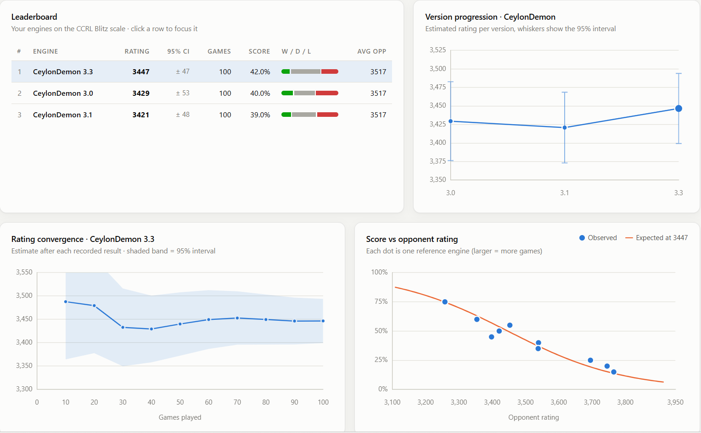

<div align="center">


# CeylonDemon 3.3


[](LICENSE)

</div>

CeylonDemon is an experimental UCI chess engine built on top of the codebase of
my own NARC engine.

A chess engine is a computer program designed to play chess. A chess engine has
two main parts: **search** and **evaluation**. The search looks ahead at the
moves that can be played from the current position, and the replies to those
moves, and so on. The evaluator judges how good each resulting position is.

CeylonDemon's evaluator is a **dual-frame NNUE** (a small, fast neural network)
called **Resonance**. Most engines judge a position from one point of view.
Resonance judges it from two:

- **AEGIS** looks from your own king's side and asks: *"Am I safe?"*
- **LANCE** looks from the enemy king's side and asks: *"How much pressure is on
  them?"*

The two answers are blended into one score. When they disagree a lot, the
position is usually sharp and hard to judge.

The network taught itself chess by studying **400 million positions from games
CeylonDemon played against itself**. It uses no games or networks from other
engines.

## Download

Ready-to-use Windows programs are on the
[Releases](https://github.com/Madushan996/CeylonDemon_Chess/releases) page:

- **`CeylonDemon-3.3-x86-64-avx2.exe`** works on most modern computers. Use
  this one if you're not sure.
- **`CeylonDemon-3.3-x86-64-bmi2.exe`** can be a little faster on newer CPUs
  (Intel Haswell and later, AMD Zen 3 and later).
- **`CeylonDemon-3.3-windows-x86-64.zip`** contains both, plus this README and
  the licence. `SHA256SUMS-3.3.txt` lets you check the downloads.

## How to use it

CeylonDemon has no board or window of its own. Load the `.exe` into a chess
program (GUI) such as Arena, Cute Chess, BanksiaGUI or ChessBase, then play
against it or use it to analyse games.

Settings you can change in the GUI:

| Setting | Default | What it does |
|---|---|---|
| `Hash` | 128 | Memory (MB) for remembering positions it has already searched |
| `Threads` | 1 | How many CPU cores it uses |
| `Move Overhead` | 30 | Milliseconds kept in reserve so it doesn't lose on time |

## How strong is it?

The total accumilative SPRT gains across all the dev versions from 2.1 to 3.3 is around 
 350 elo points , which translates upto around 200 - 250 real elo gain over 2.0. 

The approximate strength of the current version of the engine is around  **3450**.


This is a home test, not an official rating list, so treat the number as a
rough guide.




PLEASE NOT THAT THE STRENGTH OF THE ENGINE WAS ONLY MEASURED IN SHORT TIME CONTROLS, THE PLAYING STRENGTH CAN BE SIGNIFICANTLY BETTER IN LONGER TIME CONTROLS.  

## Current weaknesses

Because its evaluator reads every position twice, once from each king's side,
and its code is not yet as finely optimised as the top engines, CeylonDemon is
likely a bit slower and searches fewer positions per second. Its evaluator can
also be overconfident: it sometimes thinks it is clearly better in positions
that stronger engines see as equal. It still struggles against the very
strongest engines; in testing it has not yet beaten an engine rated above
about 3700. It has no endgame tablebase support, and its network was trained
on 400 million positions, far fewer than the billions used by leading engines.
Most testing so far has been on a single thread on one laptop.

## Build it yourself

You need GCC 12 or newer (on Windows, MSYS2 UCRT64). Then run:

```bash
make
```

or on Windows:

```powershell
.\build.ps1
```

The network is built into the program, so the result is a single `.exe`.

## More details

- [CHANGELOG.md](CHANGELOG.md): what changed in each version
- [RELEASE-3.3.md](RELEASE-3.3.md): full test results for 3.3
- [NOTICE.md](NOTICE.md): credits, and the ideas this engine borrows from
  others

## Licence

CeylonDemon is free software under the **GNU General Public License v3 or
later**. See [LICENSE](LICENSE).

Copyright © 2026 Madushan Dissanayake.
